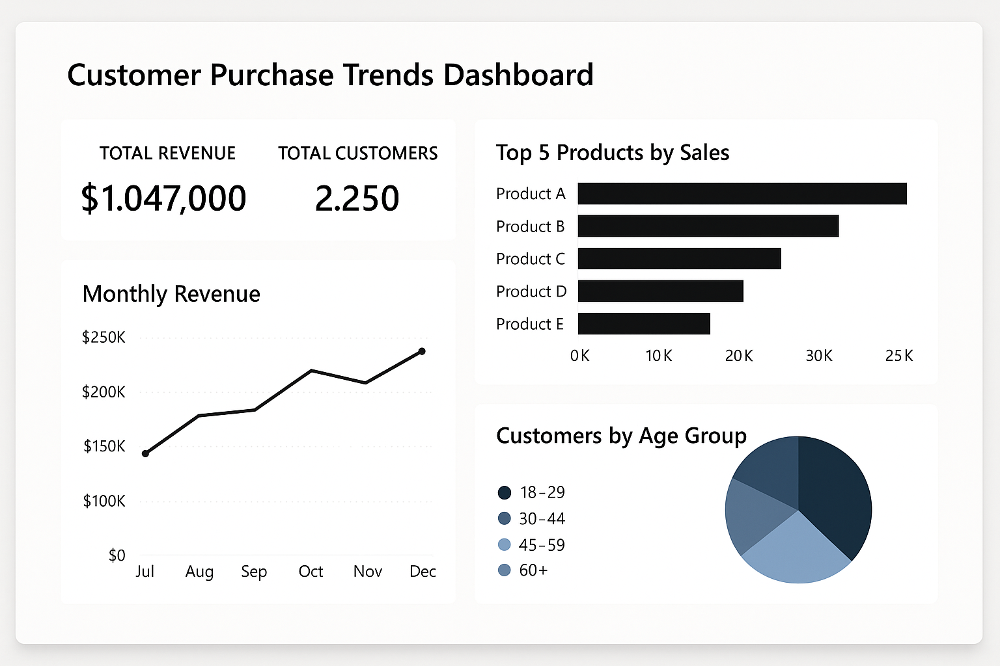

# Customer Purchase Trends Dashboard

A Power BI dashboard project that analyzes customer purchase behavior and product sales trends for a luxury goods brand.

---

## 📌 Objective

To help marketing and sales teams make better decisions using data insights from customer transactions and product sales.

---

## 🛠️ Tools Used

- **Power BI**
- **Power Query**
- **Microsoft Excel** (for source data)

---

## 📊 Dashboard Overview

**Key Features:**
- KPIs showing total revenue and total customers
- Monthly revenue trend line
- Top 5 products by sales
- Customer distribution by age group

---

## ✅ Results

- Helped identify best-performing product categories
- Enabled focused targeting by age group
- Simplified executive reporting

---

## 📁 Files Included

- `Customer_Purchase_Dashboard.png` – Dashboard preview
- `Customer_Purchase_Trend.pbix` – Power BI file 

---

## 🤝 Contributions

Feel free to fork or suggest improvements!
